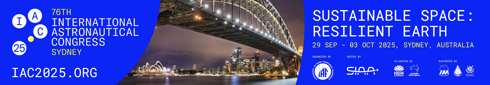

# Multi-Mode Quantum Memories for High-Throughput Satellite Entanglement Distribution


Quantum networking seeks to enable global entanglement distribution through terrestrial and free space channels; however, the exponential loss in these channels necessitates quantum repeaters with efficient, long lived quantum memories (QMs). Space based architectures, particularly satellite assisted links, offer a path to truly global connectivity, yet they demand QMs that are compatible with orbital factors such as infrared radiation and the unique challenges of operating aboard a satellite. In this work, we propose a multimode quantum memory (MMQM) for low Earth orbit (LEO) repeaters based on the atomic frequency comb (AFC) protocol. Our design integrates a hybrid alkali noble gas ensemble in an optical cavity, using alkali atoms for strong photon matter coupling and noble gas nuclear spins for minutes to hours coherence, all without the need for cryogenics. The architecture natively supports temporal and spectral multiplexing, enabling the storage of 100 modes to parallelize probabilistic operations and overcome light limited round trip times. Representative link budgets at $h = 500$ km with realistic apertures, $\eta_{\text{mem}}\gtrsim 70%$, and $t_{\text{buffer}}$ of several minutes predict improvements of up to two orders of magnitude in per pass success probability and instantaneous SKR relative to a memoryless dual downlink, with clear scaling in $N$. Our contributions are (i) a non cryogenic, space ready multimode memory, (ii) a systems analysis coupling mode count, storage time, and orbital geometry to achievable rate, and (iii) a near term implementation roadmap. Together, these results indicate feasibility with current to near term technology and provide a practical path toward a high rate, space enabled quantum internet.


## Authors
<sup>1</sup> College of Information and Computer Sciences, University of Massachusetts Amherst, USA

<sup>2</sup> Department of Physics, University of Massachusetts Amherst, USA

<sup>3</sup> Department of Space and Climate Physics, University College London, London, United Kingdom

<sup>4</sup> Department of Physics, University of California, Santa Barbara, California, United States

- [**Connor Casey**](mailto:ccasey@umass.edu)<sup>1,2</sup>
- **Albert Williams**<sup>1</sup>
- **Catherine McCaffrey**<sup>2</sup>
- **Eugene Rotherham**<sup>3</sup>
- **Nathan Darby**<sup>4</sup>


## Repository Structure


The repository is organized into several main directories:

```
quantum-memory-satellite/
├── src/                    # Source code
│   ├── quantum_memory/    # Quantum memory protocol simulation
│   │   ├── simulation.py  # Main simulation engine
│   │   ├── dynamics.py    # PDE dynamics and equations
│   │   ├── utils.py       # Utility functions and analysis
│   │   ├── plotting.py    # Visualization tools
│   │   └── geometry.py    # Geometric calculations
│   ├── link_analysis/     # Satellite link analysis
│   │   └── downlink_probability.py  # Link success calculations
│   ├── skr_calculation/   # Secret Key Rate analysis
│   │   └── skr_dual_vs_buffered.py  # Dual vs buffered comparison
│   └── main.py           # Main entry point
├── data/                  # Data storage
│   ├── input/            # Input parameter files
│   └── processed/        # Processed simulation data (CSV, HDF5)
├── plots/                # Generated plots and figures
│   ├── memory_efficiency/  # Quantum memory results
│   ├── downlink_probability/  # Link analysis plots
│   └── skr_analysis/     # Secret key rate comparisons
├── assets/               # Images and static assets
├── Dockerfile           # Docker container configuration
├── requirements.txt     # Dependencies
```

Each directory serves a specific purpose:
- `src/`: Contains all the source code organized by simulation component
  - `quantum_memory/`: Quantum memory protocol simulation using Bloch-Langevin formalism
  - `link_analysis/`: Satellite-to-ground link probability calculations
  - `skr_calculation/`: Secret key rate analysis for dual vs buffered architectures
- `data/`: Stores input parameters and processed simulation results
- `plots/`: Generated visualization outputs from all simulation components
- `assets/`: Static assets like header images and diagrams
- `Dockerfile` & `requirements.txt`: Container and dependency management

## Dependencies
[](https://www.python.org/)
[](https://numpy.org/)
[](https://scipy.org/)
[](https://matplotlib.org/)
[](https://py-pde.readthedocs.io/)
[](https://numba.pydata.org/)

Full dependencies are listed in `requirements.txt`

## Repository Contents:
- **Paper:** [Link to Published Paper](link here)

## Usage

### Quick Start with Docker

The easiest way to run the quantum memory satellite simulation is using Docker. This ensures a consistent environment with all dependencies pre-installed.

#### Prerequisites:
- [Docker Desktop](https://www.docker.com/products/docker-desktop) installed and running

#### Option 1: Build and Run Locally

1. **Clone the repository:**
   ```bash
   git clone <repository-url>
   cd quantum-memory-satellite
   ```

2. **Build the Docker image:**
   ```bash
   docker build -t quantum-memory-satellite:latest .
   ```

3. **Run the simulation components:**

   **Quantum Memory Protocol:**
   ```bash
   docker run --rm quantum-memory-satellite:latest python src/main.py quantum_memory
   ```

   **Link Analysis:**
   ```bash
   docker run --rm quantum-memory-satellite:latest python src/main.py link_analysis
   ```

   **Secret Key Rate Analysis:**
   ```bash
   docker run --rm quantum-memory-satellite:latest python src/main.py skr_analysis
   ```

4. **Access results (optional - mount output directory):**
   ```bash
   docker run --rm -v $(pwd)/plots:/app/plots quantum-memory-satellite:latest python src/main.py quantum_memory
   ```

#### Option 2: Interactive Development

1. **Run an interactive container:**
   ```bash
   docker run --rm -it -v $(pwd):/app quantum-memory-satellite:latest /bin/bash
   ```

2. **Inside the container, run simulations:**
   ```bash
   python src/main.py quantum_memory
   python src/main.py link_analysis  
   python src/main.py skr_analysis
   ```


### Simulation Components

The simulation consists of three main components:

1. **Quantum Memory Protocol** (`quantum_memory`):
   - Simulates collective spin-exchange dynamics
   - Uses Bloch-Langevin formalism with coupled PDEs
   - Outputs memory efficiency and field evolution data
   - Generates kymograph plots and magnitude analysis

2. **Link Analysis** (`link_analysis`):
   - Calculates satellite-to-ground communication probabilities
   - Accounts for atmospheric losses, diffraction, and pointing errors
   - Analyzes elevation angle dependencies
   - Produces downlink probability plots

3. **Secret Key Rate Analysis** (`skr_analysis`):
   - Compares dual vs. buffered downlink architectures
   - Calculates instantaneous secret key rates
   - Analyzes buffer time requirements
   - Generates comprehensive comparison plots

### Output Files

Results are saved to:
- `plots/memory_efficiency/` - Quantum memory simulation plots
- `plots/downlink_probability/` - Link analysis results  
- `plots/skr_analysis/` - Secret key rate comparison plots
- `data/processed/` - Processed simulation data (CSV, HDF5)


### Native Installation (Alternative)

If you prefer to run without Docker:

1. **Install Python 3.11+ and dependencies:**
   ```bash
   pip install -r requirements.txt
   ```

2. **Run simulations:**
   ```bash
   python src/main.py quantum_memory
   python src/main.py link_analysis
   python src/main.py skr_analysis
   ```

## System Requirements

### Docker Setup (Recommended):
- Docker Desktop 4.0+
- 4GB RAM minimum, 8GB recommended
- 2GB free disk space

### Native Setup:
- Python 3.11 or higher
- NumPy, SciPy, Matplotlib, py-pde, Numba, h5py
- GCC compiler (for Numba compilation)
- 4GB RAM minimum

## Contact Information:
For inquiries or collaborations related to this presentation, please reach out to Connor Casey via the provided email address in AUTHORS.txt

We appreciate your interest in our work!

## License
This project is licensed under the [Creative Commons Attribution-NonCommercial-NoDerivatives 4.0 International License](https://creativecommons.org/licenses/by-nc-nd/4.0/).


### Summary of License Terms:

- **Attribution (BY):** You must give appropriate credit, provide a link to the license, and indicate if changes were made.
- **NonCommercial (NC):** You may not use the material for commercial purposes.
- **NoDerivatives (ND):** If you remix, transform, or build upon the material, you may not distribute the modified material.

For full license details, please refer to the [Creative Commons BY-NC-ND 4.0 License](https://creativecommons.org/licenses/by-nc-nd/4.0/).